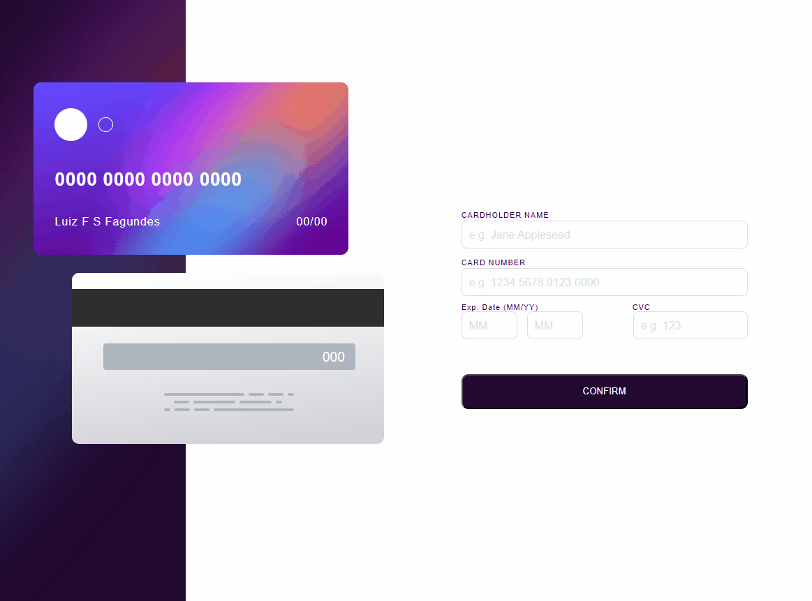

# Frontend Mentor - Blog preview card solution

Esta é uma solução para o [desafio do Interactive rating component no Frontend Mentor](https://www.frontendmentor.io/challenges/blog-preview-card-ckPaj01IcS). Os desafios do Frontend Mentor ajudam você a melhorar suas habilidades de codificação através da construção de projetos realistas.

## Índice

- [Visão geral](#visão-geral)
  - [O desafio](#o-desafio)
  - [Captura de tela](#captura-de-tela)
  - [Links](#links)
- [Meu processo](#meu-processo)
  - [Construído com](#construído-com)
  - [O que aprendi](#o-que-aprendi)
  - [Autor](#autor)
- [Agradecimentos](#agradecimentos)

## Visão geral

### O desafio

Os usuários devem ser capazes de:

- Veja os estados de foco e foco para todos os elementos interativos na página

### Captura de tela

### Links

- URL da solução: [Adicione o URL da solução aqui](https://github.com/LuizFernandoFagundes/card-details-form)
- URL do site ativo: [Adicione o URL do site ativo aqui](https://luizfernandofagundes.github.io/card-details-form/)

## Meu processo

### Construído com

- Marcação HTML5 semântica
- Propriedades personalizadas CSS
- Caixa flexível
- JavaScript

## Autor

- Site - [Luiz Fernando](https://www.seu-site.com)
- Mentor de Frontend - [@Luizfernando](https://www.frontendmentor.io/profile/LuizFernandoFagundes)

## Agradecimentos

Gostaria de agradecer aos professores do curso devQuest, e ao incrivél tipo de suporte, sem eles não seria possível a conclusão desse desafio.
com o conteudo muito bem explicado e com as aulas extremamente incriveis, pude chegar até aqui.
Quero expressar minha sincera gratidão por todo o apoio e incentivo que vocês tem me dado.
